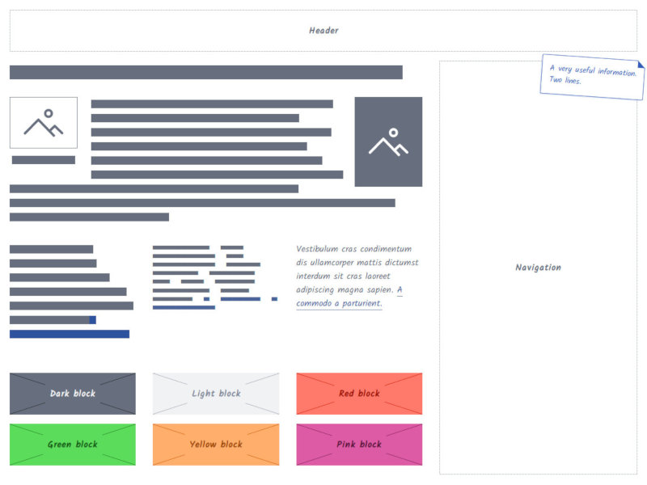

#  css-wireframes

A CSS framework to quickly design responsive wireframes directly in HTML.



## Getting started

1. Download a release, then put the CSS and Javascript files in your project folders.

2. Include your favorite CSS grid system in the `<head>`, then the wireframe CSS and Javascript.

``` html
<!-- Grid system of your choice -->
<link rel="stylesheet" href="https://cdn.jsdelivr.net/bootstrap/4.0.0-alpha.6/css/bootstrap-grid.min.css" type="text/css" />
<!-- Wireframes CSS -->
<link rel="stylesheet" href="css/wireframes.css" type="text/css" />
<!-- Wireframes Javascript -->
<script type="text/javascript" src="javascript/wireframes.js"></script>
    …
```

3. Compose your ergonomy by putting blocks where you want, and apply wireframe classes when needed.

``` html
<div class="container">
  <div class="wf-block">Header</div>

  <div class="row">
    <div class="col">
      <h1>
        <span class="wf-text-lines wf-text--important">
          Lorem ipsum dolor sit amet
        </span>
      </h1>
      <p>
        <span class="wf-text-lines">Vestibulum cras condimentum dis ullamcorper mattis dictumst interdum a commodo a parturient.</span>
      </p>
    </div>
    <div class="col-md-4 wf-optional">
      <div class="wf-block wf-block--fill">
        Navigation
      </div>
    </div>
  </div>
</div>
```

## Documentation

Check out [our documentation](http://wireframes.ldd.fr/examples/) for a live demo and detailled explanations.

## Credits

### Icon set
The icons are based on the [sketchy icon set by Alice Mortaro](https://thenounproject.com/allie.fanni/collection/sketchy-wireframe/).
Licence : [Creative Commons](http://creativecommons.org/licenses/by/3.0/us/) 